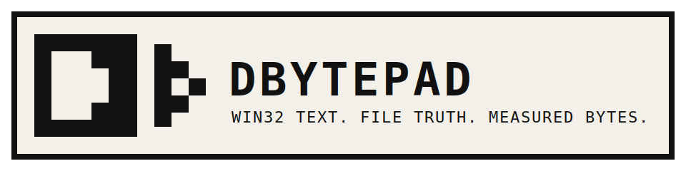

# DBYTEPAD


Small Win32 text editor written in C.

No Electron. No webview. No telemetry.


## Build

```bat
build.bat
```

Output:

```text
build\dbytepad.exe
```

## Run

```bat
build\dbytepad.exe README.md
```

## Features

- Open and save text files.
- Open files from the command line.
- Open files in read-only mode.
- Find and Find Next.
- Word Wrap.
- Drag and drop file open.
- File Facts.
- Line, column, char count, and UTF-8 byte count.

## Release

Current release: v1.0.2

Measured build:

- exe: 174080 bytes
- source: 864 lines
- source: 25190 bytes

See `docs/BYTE_LEDGER.md`.

## License

MIT. See `LICENSE`.
